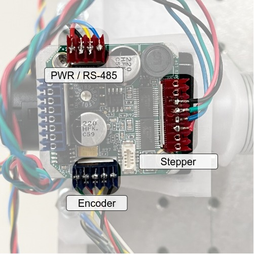
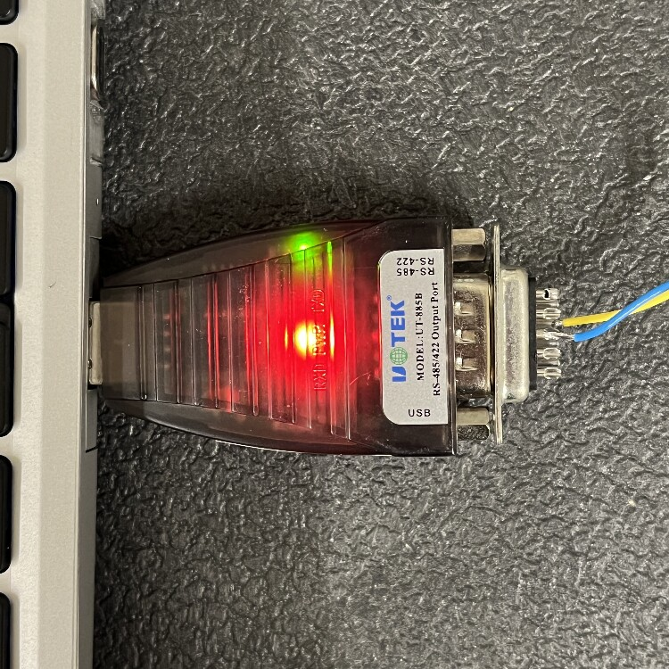
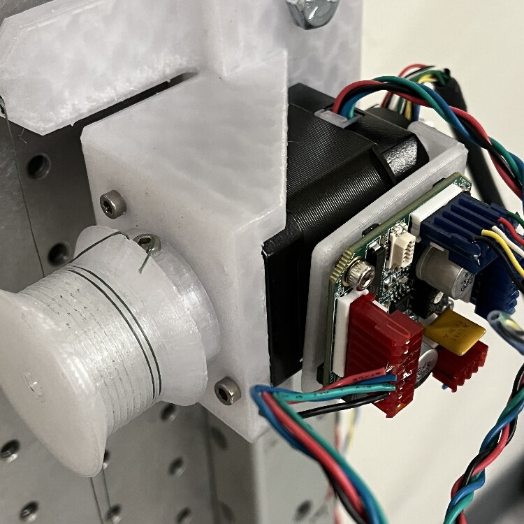
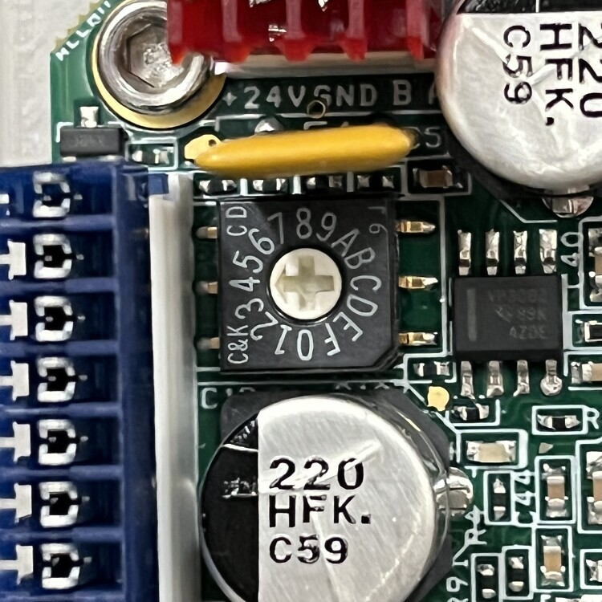
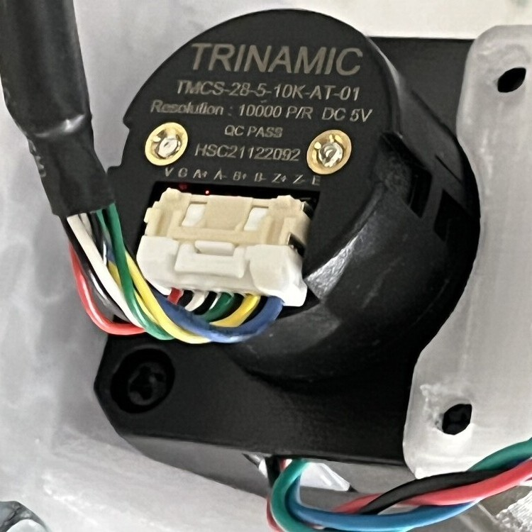
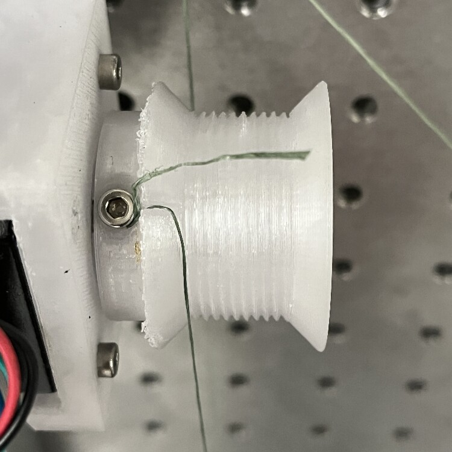
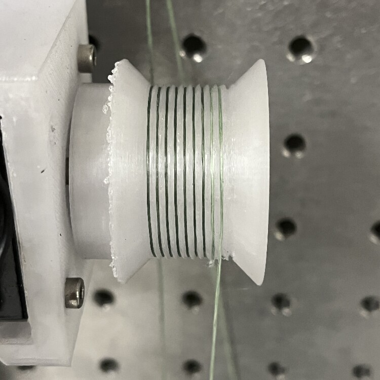
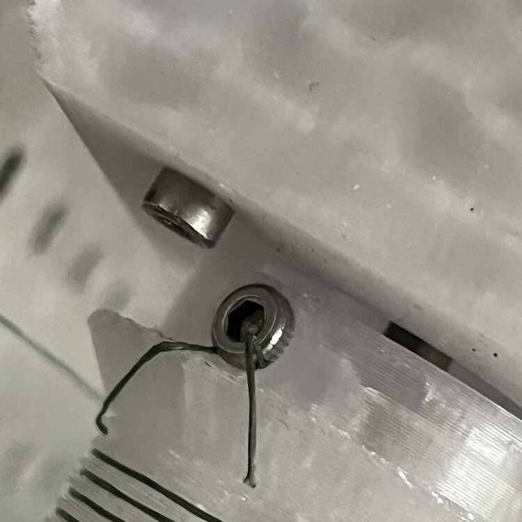
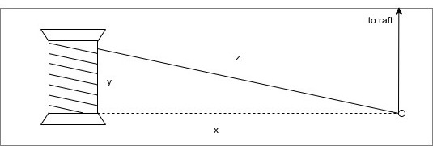

# How To

This doc contains instructions for various tasks related to setting up and running the `hotspot` mirror mapper.

#### What is `hotspot`?


`hotspot` is a planar cable-driven parallel robot (CDPR), with four stepper motors that move a central raft of hot IR sources by changing the length of cables attached to it. The cables are fixed to an adjustable frame. The frame can clamp to any rectangular surface, but it was designed to clamp to various relay mirrors that couple radiation from the sky to the TIME spectrometer inside the receiver cabin on the APA 12M telescope on Kitt Peak, allowing an electronically controlled, hot, IR-emitting source to be swept across the mirror to observe the detectors' spatial response.

#### What is this document?

This document is a comprehensive how-to on setting up, maintaining, and running the mirror mapper. It contains all the information that would be needed to replace and reconfigure major components of the system, however unlikely that may be.

It is organized in order of information flow: from the operator (you!) logging into the control computer, to setting up the software environment, connecting the power and signal cables, assembling the mapper frame, creating input files, mounting it on various mirrors, and operating the mapper. 

## Using the control computer

The mapper motors are controlled by running the `main.py` application on a computer with a [USB-to-RS485 adapter](https://www.uotek.com/pro_view-122.html). The IR sources are controlled via a USB cable connected to a microcontroller. You should check out the `hotspot` repo if you wish to run the mapper or [generate new input files](#ok-but-is-there-an-easy-way-to-make-a-new-one).

## Setting Up the Environment

To run `hotspot`, you must satisfy the dependencies. They are enumerated in `hotspot.yml`, a human-readable file that can be ingested by the `conda` Python package manager.

#### Is the environment set up?

First, check that the environment setup has not been done before. If 

```bash
conda activate hotspot
```
succeeds, skip to [software testing with pytest](#software-testing-with-pytest).

### Anaconda

#### Is Anaconda set up?

If the Python environment/package manager [Anaconda](https://www.anaconda.com/) does not exist on the computer you're running this on, I recommend installing Miniconda according to [the instructions](https://docs.conda.io/en/latest/miniconda.html#installing).

Once that is done, we are ready to set up the `hotspot` environment. `conda` environments keep a project's dependencies from polluting your computer's environment and make sure they all play nicely together. `conda` allows specifying the dependencies needed in a file with a `.yml` extension. This is done for you. Create the `hotspot` conda env with

```bash
conda env create -f hotspot.yml
```

It should install things like `numpy` and `matplotlib`, as well as libraries for the hardware, such as the `pyserial` library for driving the steppers, and the `labjack-ljm` library for controlling the Hawkeye IR sources via the LabJack. There are also packages for documentation.

### Keeping things up to date

If you need to install something new later on, remember to update `hotspot.yml` by doing 

```bash
conda env export --from-history | tee hotspot.yml
```

If your `hotspot.yml` has been updated, and you need to update your env with the new `hotspot.yml`, do

```bash
conda env update --file hotspot.yml --prune
```

## Software Testing with `pytest`

In order to verify that basic low-level functionality is unbroken, run `pytest` from the toplevel directory of the repo.

## Power

### Motors

#### Do the motor driver boards have power?

Each motor is controlled by an [AllMotion EZStepper EZHR17EN](https://www.americancontrolelectronics.com/ezhr17en). These are [chopper driver](https://homepage.divms.uiowa.edu/~jones/step/current.html#pwm) boards that accept 10-40 V input.



Configure a constant-voltage DC power supply to provide:

* 24 V
* 4 A

The EZStepper drivers are configured in software to draw 50% of the rated 2 A current = 1 A each, for a total of 4 A. In use, the motors may draw somewhat less current.

> **Note:** See the AllMotion/American Control Electronics wiring diagram to identify the Vin and GND inputs.

### Hawkeyes

#### Do the Hawkeyes have power?

The Hawkeyes are mounted on a PCB and powered by a power supply connected to the screw terminal. Positive and negative terminals are labeled.


Requirements:

* 6.7 V (constant voltage)
* ≥ 2 A

The Hawkeye IR-50 source temperature depends on the voltage applied, and the current draw depends on the voltage (see datasheet in `pdf` dir). The design target temperature is 750 C, requiring a voltage of 6.7V and a current of ~134mA per source, for a total current draw of ~1.74A when all sources are turned on. In practice, Hawkeye sources have not drawn quite this much current.

There will be some voltage drop at the screw terminal; this is normal. If one source is powered, the voltage drop is negligible, but if all 13 sources are powered, the voltage drop is approximately .22 V. Do not attempt to compensate for this at the power supply! If you turn up the supply voltage to 6.9 V to get 6.7 V under a 13 source load, a load of a single source will see 6.9 V, drastically reducing its lifetime.

### Hawkeye Microcontroller

The Hawkeye sources are turned on and off by an Adafruit Trinket M0 microcontroller. It gets 5V power via a micro USB cable.

#### Does the microcontroller have power?

The Trinket M0's power LED will illuminate when it is connected to the USB port. The Trinket GND pin should be connected to the Hawkeye power supply's ground terminal.

## Frame

#### Is the frame fully assembled?

The 3D printed stepper motor mounts are attached to the beam mapper frame by 5/16-18 x 2" or 2.25" bolts with nyloc "jam" nuts.

Two aluminum registration tabs are screwed into the end of each frame piece opposite the black plastic end caps, using a 5/16-18 x 1/4" screw. They are long enough to reach an edge of the mirror regardless of if the mirror's corners have been machined off. 

> **NOTE:** These tabs register the frame to a third edge of the mirror, so **it is important that they not be bent**.

Long 5/16-18 steel threaded rods connect the two halves of the frame. On one end of the threaded rods, threads in the aluminum extrusion provide clamping force. On the other end of the threaded rod, a slide-adjust nut with a thumb button allows easily changing the distance between clamping surfaces, and applies clamping force to the outside of the opposite aluminum extrusion. Care should be exercised with this slide-adjust nut, as pressing the button will release any tension on the threaded rod.

## Motion Outputs

### Motors

#### Can the computer talk to the motor drivers?

The EZHR17EN stepper drivers receive commands from a control computer running the `hotspot` software as bytes over the [RS485](https://hackaday.com/2022/04/05/hacker-dictionary-rs-485-will-go-the-distance/#more-528633) physical layer.

> **Note:** Refer to the AllMotion/American Control Electronics EZHR17EN wiring diagram to verify that the RS485 communications connection is correct.

The control computer needs either a 9-pin serial output port, or a USB-to-RS485 adapter to send bytes out over the RS485 bus. The inverting/non-inverting outputs are blue and yellow wires. If you are connecting your adapter to the bus for the first time, you may have to guess incorrectly and swap the wires before it will work.



The motor drivers must have power and ground (via the 24 VDC power supply) to receive commands.

> **NOTE:** RS-485 Connections ought to have a ground wire, although you don't see one pictured here. This is to ensure the differential signal at each receiver is biased correctly. If you experience communication issues on the RS-485 bus, ensure proper grounding.

#### Can the motor drivers command the motors?

> **Note:** Refer to the AllMotion/American Control Electronics EZHR17EN wiring diagram to verify that the motor winding connections are correct.

The stepper motors themselves have NEMA-17 spec hole patterns, which mate to the 3D printed motor mount brackets which are attached to the beam mapper frame. Each stepper motor should be attached to its motor mount using M3 x 0.5 x 10 mm screws. If attaching motors for the first time, use lubricant, because metal on plastic will be squeaky.



At this point, it is important to consider the mapping of motor driver board address -> stepper motor -> motor mount -> corner of beam mapper frame -> corner of raft. The `Executive.__init__()` function in `executive.py` specifies this mapping, so the motor installation location and stepper instance in `__init__()` should match, to ensure the correct motor commands are sent to the correct stepper. The stepper driver boards are addressable with a selector switch on top. Match the address selector to the correct corner of the raft in the `__init__()` function.



#### Can the encoders provide position feedback?

The EZHR17EN boards are capable of reading out [quadrature encoders](https://cdn.sparkfun.com/datasheets/Robotics/How%20to%20use%20a%20quadrature%20encoder.pdf) affixed to the stepper shafts. Encoder feedback is critical for accurate positioning of the raft.



> **Note:** Refer to the AllMotion/American Control Electronics EZHR17EN wiring diagram to verify that the encoder connections are correct.

### Spools

#### Can the motors make the lines longer and shorter?

The stepper motors drive winch-like drums directly, to change the length of the cables predictably. They are cylindrical drums with helical threads to accept the cables.





If they are not already attached, the cable drums should be fixed to the 5 mm stepper motor shaft via one M3 setscrew.

The fishing line is affixed to the each spool by wrapping it around the setscrew and screwing it in to the threaded recess on the spool circumference. Do not overtighten, as the threads are plastic.



> **NOTE:** Positive motor rotation is defined by convention to spin the shaft clockwise when viewed from the rear of the motor. Cables should be oriented relative to the spool such that a positive motor rotation produces a positive cable length change (i.e., cable is played out from the spool), and a negative motor rotation winds cable onto the spool.

Since helical threads change the position along the drum $y$ that the cable exits as a function of motor position, the actual length of the cable at any given rotational position is given by $z$. If not mitigated, this imparts an error in actual cable length at any given position of $z - x$. To mitigate this, we route the cable from each drum a distance $x$ much greater than the height of the drum helix $y$, to the opposite E-W side of the frame. Then we can leverage a small angle approximation to assert that the error in position imparted by the extra length $z - x$ is negligible (<< 1 mm).



After attaching the cables to the spools, the other end should be threaded through the ~.9mm hole in the motor mount bracket on the opposite E-W side of the frame.

> **NOTE:** All cables should be cut long enough to permit the raft to visit each corner of the frame, even when the frame is as far apart as it can be (~25.5").

Finally, excess cable should be wound onto the drum by hand, under tension, to ensure the cable is seated in the drum's grooves.

## Radiation Outputs

#### Will moving the cables move the Hawkeyes?

The end effector of this robot is a rectangular raft carrying several Hawkeye Technologies [IR-50](http://www.hawkeyetechnologies.com/source-selection/pulsable/) emitters. The robot drives the centroid of the effector to a specified position, and the control algorithm performs a sequence of flashes using a number of the emitters to enhance the detectability of the signal in the IR receiver output data.

[photo of raft]

Pass the cables that emerge from the corner eyelets to the closest eyelets on the raft. Wrap the ends of the fishing line around the screws in each corner of the raft, and screw them down.

#### Can the computer command the Hawkeyes?

The Hawkeye IR sources are arranged in roughly 3 concentric circles. Each circle is a separately controllable group of sources, which can be turned on and off by the control software. The first group is a single center source. The second group is the inner ring of six sources surrounding the center. The third group is the outer ring of six sources. Turning on more sources increases the intensity that the TIME receiver sees; this may be necessary for mapping optics where the beam is less concentrated.

Each group is turned on and off by a MOSFET on the raft. The MOSFET gates are controlled by the outputs of a [shift register](https://en.wikipedia.org/wiki/Shift_register) chip. The shift register multiplexes 8 bits (a byte) received at its input to its 8 output pins. Only 3 of the 8 are connected to MOSFETs.

The shift register receives a byte from an Adafruit Trinket M0 microcontroller over [SPI](https://en.wikipedia.org/wiki/Serial_Peripheral_Interface) via the black silicone ribbon cable, which should be hooked up to the grey connector on the raft. The connector pinout is on the back of the PCB. The other end of the cable is soldered to the Trinket M0 pins.


The data connection pinout from the Trinket M0 to the ribbon cable connector is as follows:

* Trinket M0 GND → GND
    * The shift register GND must be the same as the microcontroller ground. This should be grounded to the Hawkeye power ground as well.
* Trinket M0 BAT → 5 V
    * 5 V from the USB connector appears here. This powers the shift register.
* Trinket M0 2 → LATCH
    * This pin goes low when an SPI transfer is started
* Trinket M0 4 → CLK
    * This pin pulses during an SPI transfer to delineate bits to the shift register.
* Trinket M0 5 → PICO (peripheral input, controller output)
    * This pin goes low or high during an SPI transfer to send bits to the shift register.


The Trinket M0 receives a byte from the control computer over a USB serial connection and forwards it to the shift register over SPI.

| Profile Input File .csv: `flasher_cmds` value | Trinket M0 SPI Output | Bit Representation (Shift Register Outputs) | Trinket M0 RGB LED Color | Hawkeyes On          |
|-----------------------------------------------|-----------------------|---------------------------------------------|--------------------------|----------------------|
| 0                                             | 0                     | 0000000                                     | (Dimmed)                 | None                 |
| 1                                             | 1                     | 0000001                                     | Red                      | Center               |
| 2                                             | 2                     | 0000010                                     | Green                    | Inner                |
| 3                                             | 3                     | 0000011                                     | Yellow                   | Center, Inner        |
| 4                                             | 4                     | 0000100                                     | Blue                     | Outer                |
| 5                                             | 5                     | 0000101                                     | Purple                   | Center, Outer        |
| 6                                             | 6                     | 0000110                                     | Cyan                     | Inner, Outer         |
| 7                                             | 7                     | 0000111                                     | White                    | Center, Inner, Outer |

The control computer will flash whichever group of Hawkeyes is specified by the input profile .csv file at 5 Hz.

### Cable Maintenance

#### What if a cable breaks?

The original cable is Spiderwire EZ Braid braided dyneema fishing line (50 lb pull strength), chosen for its stretch resistance. A replacement can be found at any tackle store or Wal-Mart, but a spool of extra cable should already be stored with the beam mapper.

[photo of line replacement]

Cable length should be carefully sized to allow the raft to reach all corners of the workspace, but with as little extra length as possible at the maximum allowed separation of 25.5".

## Coordinate System

 In order for the raft to be moved to a meaningful position in mirror-space, coordinates must be referenced to sensible locations where the mirror edges and robot frame register to one another.

 * **x-axis**: plane of contact between the "south" frame and an edge of the mirror
 * **y-axis**: plane of contact between the "west" side aluminum registration tab and a perpendicular mirror edge.
 
 The coordinate system of the robot therefore has its origin at the SW corner, where the aluminum alignment tab on the fixed frame meets the aluminum extrusion face.
 
## Input Files

There are two types of input files: `geometry` and `profile`.
Read on to learn what they are for and what is inside each.

#### Ok, but is there an easy way to make a new one?

`.ipynb` files are provided in the `data/input/*` directories to assist with making these input files. Most likely, you will only need `data/input/create_profile.ipynb`.

You will need Jupyter installed on the computer running this notebook. Then simply copy the new files to the `/data/input/*` directory.

### Geometry
Geometry files are one-line .csv files in `data/input/geometry`. 

`create_geometry.ipynb` is provided to script the creation of geometry files.

Each one defines the physical setup of the robot when it is in a certain configuration, for instance, when it is installed on a mirror of a certain dimension. Each column entry describes an aspect of the physical setup of the system. A simplistic example:

| sw_0  | sw_1  | nw_0  | nw_1  | se_0  | se_1  | ne_0  | ne_1  | w  | h |
|:--:|:--:|:--:|:--:|:--:|:--:|:--:|:--:|:--:|:--:|
| 0  | 0  | 0  | 1  | 1  | 0  | 1  | 1  | .1  | .1 |


Each corner point is the location of an **eyelet** through which the cable passes, expressed relative to the SW origin, described above. The width and height of the raft are defined by the separations between eyelets on the raft through which the cable passes.

> **NOTE:** If the dimensions of the frame eyelets have been measured relative to each edge, the y-positions of the corner eyelets can be calculated as a function of the separation between the aluminum extrusions that make up the support structure and clamping surfaces.

> The eyelets of the motor mounts measured 6.19 +/- 0.5 mm from the frame to the face of the motor mount bracket on the interior of the mapping region, and 7.96 +/- 0.02 mm from the face of the motor mount to the eyelet, for a total eyelet offset from the contact patch of 0.014 +/- 0.001 m. This value will be used to calculate eyelet y-positions as a function of frame separation.

> The eyelet positions should not ever change in the x-direction, unless the motor mounts are removed from the aluminum frames.

### Profile

Profile files are multi-line .csv files in `data/input/profiles`. Each line defines a new position to which the robot should move, in the coordinate system defined above, and which group of Hawkeye sources should be flashed.

`profiles/create_profile.ipynb` is provided to script the creation of profiles.


Upon reaching each location in the profile, the robot is programmed to flash Hawkeye sources on and off (default: 10 "on" states, 50% duty cycle, 5 Hz). Which group of sources is enabled is configurable with the `flasher_cmds` column in the profile .csv. See the table in the previous section. Some examples follow.

For example, to move to a single coordinate and flash all three groups of Hawkeyes:

| flasher_cmds | pos_cmd_0s | pos_cmd_1s |
|:------------:|:----------:|:----------:|
| 7            | .5         | .5         |

to move to a single coordinate and flash only the center Hawkeye:

| flasher_cmds | pos_cmd_0s | pos_cmd_1s |
|:------------:|:----------:|:----------:|
| 1            | .5         | .5         |

to move to a single coordinate and flash the center and inner ring Hawkeyes:

| flasher_cmds | pos_cmd_0s | pos_cmd_1s |
|:------------:|:----------:|:----------:|
| 2            | .5         | .5         |

Building up a sequence of these moves allows a shape to be scanned.

## Output Files

Output files store telemetry for each run in `data/output`. They are timestamped `.hdf5` files.

## Physical Installation

### General tips

* Having two people helps.

* _<span style="color:red">**BE VERY CAREFUL** about touching the buttons on the black slide-adjust nuts</span>_
    * If you are adjusting the mapper spacing and you let them off of the threaded rod, they will disassemble themselves rapidly. You don't want to lose any parts.
    * If you are loosening or tightening the mapper down to anything, when the mapper is under tension, touching the button could release tension rapidly, potentially causing a fall, which you do not want.

* Bring a USB extension cable to make moving the frame to various mirrors easier. That will extend RS485 connection, allowing you to stand or sit in a more comfortable spot.

* Bring a lot of flat Eccosorb panels. Don't bother trying to tape Eccosorb to anything. It won't stick. Just pinch it in between the mirror and threaded rod. This also helps keep the threaded rod or raft from marring the mirror surface, which is very important.

* Keep as much stuff (power/data cables, hands, heads, ladders) as possible out of the path of the beam.

### K1

Underneath shutter, highest up. Put a step ladder inside the K-mirror frame to make the lift easier. Route Hawkeye cables around back of K1 and down.

`python main.py ./data/input/geometry/K1.csv ./data/input/profiles/K1_<profile>.csv`


### K2

Should be easy. Remove the anti-head-smasher foam first to get to the bottom clamping surface.

`python main.py ./data/input/geometry/K2.csv ./data/input/profiles/K2_<profile>.csv`


### K3

Pucker factor 11. Gravity is working against you, and you're right above F1, but snug things down good and tight when mounting the mapper and you will be fine. I used a crescent wrench on the black slide-adjust nuts for this one, to get a lot of clamping force. _<span style="color:red">**Be careful not to release the slide-adjust nuts when using the wrench.**</span>_

`python main.py ./data/input/geometry/K3.csv ./data/input/profiles/K3_<profile>.csv`


### F1

Another easy one.

`python main.py ./data/input/geometry/F1.csv ./data/input/profiles/F1_<profile>.csv`


### P2

Easy. It's down on the floor near the wall.

[photo of mapper mounted on P2]

## Operation

When a surface geometry file has been created and the profile for the given shape to be mapped is generated, we are ready to run the program. There should already be geometry and profile files for each mirror in the `data/input` directories.

## Homing

### Pre-mapping checks

1. Make sure that 24 V is being supplied to all driver boards and that the polarity is correct.
2. Make sure that 6.7V is being supplied to the Hawkeyes.
3. Make sure the power supply output is on.
4. Make sure that the cable is wound onto each spool and that no loops of excess cable are trapped underneath the cable wound onto the spools.
5. Check the excess cable played out in the raft's current position. Some excess is fine as long as it doesn't interfere with the raft's motion.
6. Ensure the Hawkeye source power and data cables lines won't interfere with mapper operation.
7. Ensure the `hotspot` `conda` env is active: `conda activate hotspot`.

### Mapping

1. Start the program with `python main.py ./data/input/geometry/<geometry.csv> ./data/input/profiles/<profile.csv>`
2. Perform a homing calibration: `c`, `RETURN` key. 
3. The motors will drive to each corner in turn, bumping the hard stop three times in order to measure the encoder position where 0 mm of cable is played out. When complete, it will move to the center of the workspace.
4. Verify that the raft reached its home position in the center of the workspace, and that the other axes achieved tension. If not, GOTO 2. If homing succeeded without incident and cables are not taut, check the measurements of the corner eyelets and the raft dimensions provided in the geometry input .csv file.
6. Perform a mapping sequence: `s`, `RETURN` key. 
7. The raft will drive to each location and flash the Hawkeyes at each point in the sequence. Observe the mapper, ensuring the Hawkeye signal cable does not interfere with the mapper.
    1. You may request a mode change at any time. Mode changes are processed at the end of each move.
    2. You may abort the program with `Ctrl+C`.
8. Upon completing a sequence, it may be repeated by requesting the sequence mode again.

## Other Documentation

### Example Call Graph


## Module Flow Charts

### Executive

[updated flow charts here]

## Reference HTML
The html documentation of the source code and Markdown materials is generated by [portray](https://timothycrosley.github.io/portray/).

To regenerate the documentation, execute:

```bash
portray as_html -m hotspot -o docs/html/ --overwrite
```

## `pycallgraph`

To re-generate the call graph image, run
```bash
pycallgraph -i "alg*" -i "const*" -i "exec*" -i "hardw*" -i "hot*" -i "hw*" -i "tele*" graphviz --output-file=docs/img/pycallgraph.png -- main.py data/input/geometry/test_surface.csv data/input/profiles/box_frame.csv
```
You must have `graphviz` installed using your operating system's package manager.
