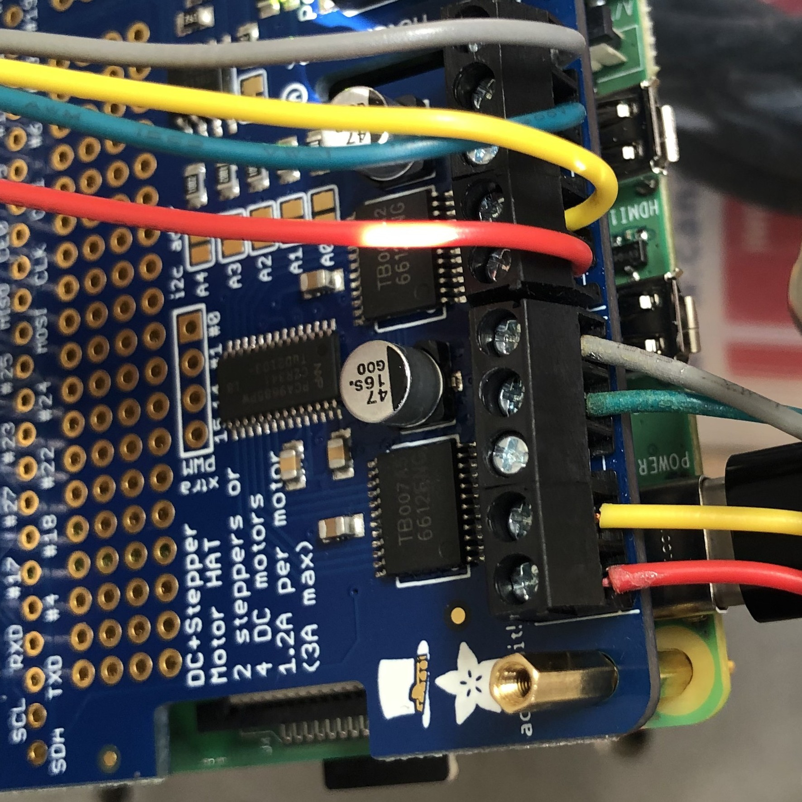
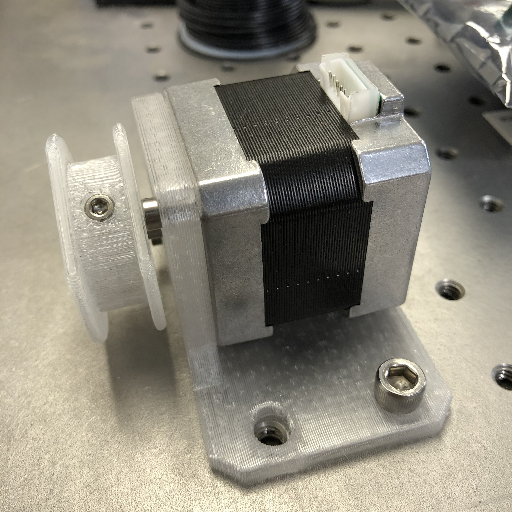
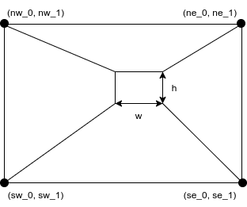
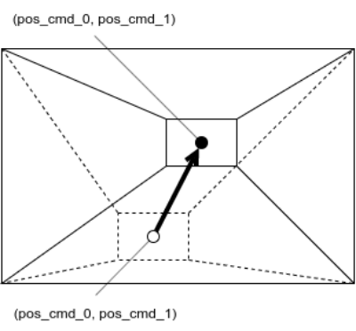
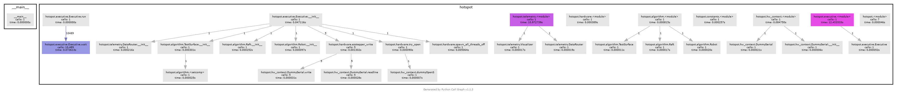
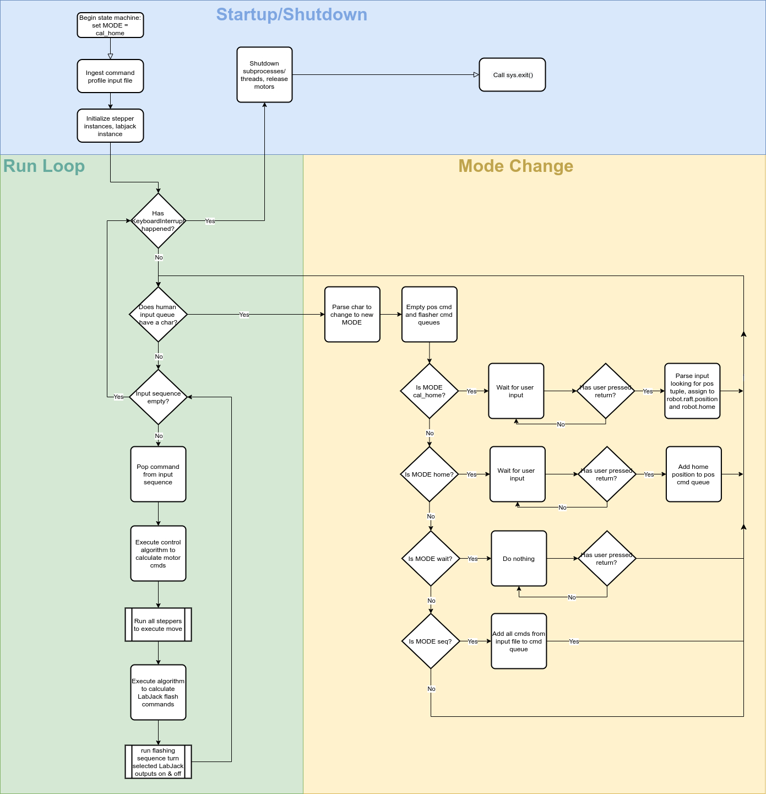

# How To

This doc contains instructions for various tasks related to setting up and running the beam mapper.

# Setting Up the Environment

First, check that the environment setup has not been done before. If 
``` bash
conda activate hotspot
```
succeeds, skip these steps.

## Python Dependencies
### Anaconda
If the Python environment/package manager [Anaconda](https://www.anaconda.com/) does not exist on the Raspberry Pi you're running this on, I recommend installing Miniconda like this:

``` bash
curl "https://repo.anaconda.com/miniconda/Miniconda3-latest-Linux-armv7l.sh" -o "Miniconda.sh"
chmod +x Miniconda.sh
./Miniconda.sh
```

Once that is done, we are ready to set up the `hotspot` environment. `conda` allows specifying the packages needed in a file with a `.yml` extension. This is done for you. Create the `hotspot` conda env with

``` bash
conda env create -f hotspot.yml
```

It should install things like `numpy` and `matplotlib`, as well as libraries for the hardware, such as Adafruit's `adafruit-circuitpython-motorkit` library for driving the steppers, and the `labjack-ljm` library for controlling the Hawkeye IR sources via the LabJack.

However, driving Hawkeye sources with LabJack Python modules requires both the system libraries and the Python interface to be installed.

[Download and install](https://labjack.com/support/software/installers/ljm) the LJM libraries from LabJack.

Once that is done, activate the env with 

``` bash
conda activate hotspot
```
## Keeping things up to date

If you need to install something else, remember to update `hotspot.yml` by doing 

``` bash
conda env export --from-history | tee hotspot.yml
```

If your `hotspot.yml` has been updated, and you need to update your env with the new `hotspot.yml`, do

``` bash
conda env update --file hotspot.yml --prune
```

# Software Testing with `pytest`

In order to verify that basic low-level functionality is unbroken, run `pytest` from the toplevel directory.

# Setting Up the Hardware

## Enable Raspberry Pi Hardware

The raspberry pi should have at least two [motor driver hat boards](https://learn.adafruit.com/adafruit-dc-and-stepper-motor-hat-for-raspberry-pi). These are PCBs with onboard chips that talk to the raspberry pi on an I2C bus via the 2x20 header pins. They issue commands to the motor driver chips, which handle the delivery and timing of greater voltage and current than the raspberry pi is capable of on its own.

Follow the steps for [Enabling I2C communication](https://learn.adafruit.com/adafruit-dc-and-stepper-motor-hat-for-raspberry-pi/installing-software#enable-i2c-1106864-2) from Adafruit. A backup pdf is saved in the `pdf` dir.

## Power

### Motors
The motor driver board must be powered via its own power supply, since the raspberry pi cannot provide the requisite voltage or current. A lab power supply with 12V output is attached to the +/- screw terminal block on the motor driver hat. For stacking multiple hats, jumpers are attached to the screw terminals to route +/- voltage to the additional hats. The motor controllers on each hat are designed to run with 5-12V, with a maximum instantaneous current of ~1.2A.

### LabJack
The LabJack board also needs its own power supply to drive the voltage/current that is switched via the breakout board. A tunable lab power supply is attached to one of the screw terminals labeled "VS#," for "voltage source #," where # is one of the channels, 1-6. The voltage of this power supply will depend on what is hooked up to the switchable terminals. If you are using LEDs to stand in for Hawkeye IR sources (e.g. for testing), 3.3V is fine.

The Hawkeye IR50 source temperature depends on the voltage applied, and the current draw depends on the voltage (see datasheet in `pdf` dir). The design target temperature is 750 C, requiring a voltage of 6.7 V and acurrent of ~134 mA per source, for a total current draw of ~1.74 A when all sources are turned on. The power supply must be able to meet these requirements.

## Communication

### Raspberry Pi
You can log in to the raspberry pi via `ssh`. In order for your computer to "see" the raspberry pi, though, they must be on the same network. This can be accomplished a few ways (or order of ease of use):
1. By connecting both computers to a router or network switch that can assign each connected device an IP address automatically. Wired is easier than [wireless](https://www.raspberrypi.com/documentation/computers/configuration.html#setting-up-a-headless-raspberry-pi).
1. By connecting directly to the pi via an Ethernet patch cable and setting up a [link-local](https://en.wikipedia.org/wiki/Link-local_address) connection
1. By connecting directly to the pi via an Ethernet patch cable and assigning static IP addresses to each host.

The first option is the easiest, but depends on having access to an exisiting network, so limits your connectivity options. If you have access to a Linux machine, the second option is about as easy and more flexible, in my opinion.

 The hostname and password are printed on the bottom of the white plastic case. Once connection is sorted out, ping the pi to make sure:
 
 ``` bash
 ping timepi.local
 ```
 
 The ssh command goes like this:

 ``` bash
 ssh -X pi@timepi.local
 ```

 `-X` allows X-forwarding, in case a graphical application (like plotting) is invoked. You will be prompted for a password, which you can find printed on the bottom of the white plastic raspberry pi case.

### Motors

Motors should be connected to the screw terminals of the pi's stepper hat like this:



Getting the order right ensures the stepper's coils are energized in the correct sequence to get it to rotate.

The stepper motors have NEMA-17 spec hole patterns, which mate to the 3D printed CFRP motor mount brackets which we will attach to the beam mapper frame. Each stepper should be attached to its motor mount using M3 x 0.5 x 10mm screws. Use lubricant, because metal on CFRP will be squeaky.

At this point, it is important to consider mapping of motor HAT terminal -> stepper motor -> motor mount -> corner of beam mapper frame. The `Executive.__init__()` function specifies this mapping, so the motor installation location and stepper instance in `__init__()` should match, to ensure the correct motor commands are sent to the correct stepper.

In general, the HAT closest to the Pi will be `kit0` (although this can be double-checked by looking at the address - `0x60` is the default I2C address for the hat, which can be changed by bridging the HAT pads A0-A4, so the board addressed by `0x60` will have no pads bridged). The terminal blocks M1-M2 are used for `stepper1` on each HAT, and M3-M4 are used for `stepper2`.

It doesn't matter which terminal maps to which corner, only that the code and physical arrangement agree.

## Spools

The spools are each attached to the 5mm stepper motor shaft via one M3 setscrew. The fishing line is affixed to the each spool by wrapping it around the setscrew and screwing it in to the threaded recess on the spool circumference. 



Positive motor rotation is defined by convention to spin the shaft clockwise when viewed from the rear of the motor. Motors should be oriented relative to the cable such that a positive motor rotation produces a positive cable length change (i.e., cable is played out from the spool), and a negative motor rotation winds cable onto the spool.

After attaching the cables to the spools, the other end should be routed through the ~.9mm hole in the motor mount bracket.

Finally, excess cable should be wound onto the spool, under tension, to avoid trapping excess cable underneath as the cable is wound on. This process can be done by hand.

## Raft

The end effector of this robot is a rectangular raft carrying several Hawkeye Technologies [IR-50](http://www.hawkeyetechnologies.com/source-selection/pulsable/) emitters. The robot drives the centroid of the effector to a specified position, and the control algorithm performs a specific sequence of flashes using a number of the emitters to enhance the detectability of the signal in the TIME receiver output data.

The effector is attached to the cables by simply passing them through the raft's eyelets, wrapping ends of the fishing line around the screws in each corner of the raft, and screwing them down.

## Frame

The 3D printed CFRP stepper motor mounts are attached to the beam mapper frame by 5/16-18 x 2" or 2.25" bolts with nyloc "jam" nuts.

Two aluminum registration tabs are screwed into the end of each frame piece opposite the black plastic end caps, using a 5/16-18 x 1/4" screw. They are long enough to reach an edge of the mirror regardless of if the mirror's corners have been machined off. These tabs register the frame to a third edge of the mirror, so **it is important that they not be bent**.

Long 5/16-18 steel threaded rods connect the two halves of the frame. On one end of the threaded rods, a nyloc "jam" nut on the outside of the perforated aluminum extrusion provides clamping force. On the other end of the threaded rod, a slide-adjust nut allows easily changing the distance between clamping surfaces, and applies clamping force to the outside of the opposite aluminum extrusion. 

When all of these pieces are attached to the frame, it is ready to install onto a mirror for mapping. The frame should be opened wide enough to allow it to fit over a mirror, then clamped down to register against two opposite faces.

# Physical Installation and Input File Creation

## Coordinate System
 In order for the raft to be moved to a meaningful position in mirror-space, coordinates must be referenced to sensible locations where the mirror edges and robot frame register to one another. The x-axis is in the plane of contact between the "south" frame and an edge of the mirror. The y-axis is in the contact plane between the side aluminum registration tab and a perpendicular mirror edge. The coordinate system of the robot therefore has its origin at the SW corner, where the aluminum alignment tab on the fixed frame meets the aluminum extrusion face.
 
## Input Files

There are two types of input files: geometry and profile.

### Geometry
Geometry files are one-line .csv files in `hotspot/data/input/geometry`. Each one defines the physical setup of the robot when it is in a certain configuration, for instance, when it is installed on a mirror of a certain dimension. Each column entry describes an aspect of the physical setup of the system. For example:

| sw_0  | sw_1  | nw_0  | nw_1  | se_0  | se_1  | ne_0  | ne_1  | w  | h |
|:--:|:--:|:--:|:--:|:--:|:--:|:--:|:--:|:--:|:--:|
| 0  | 0  | 0  | 1  | 1  | 0  | 1  | 1  | .1  | .1 |



Each corner point is the location of an eyelet through which the cable passes. The width and height of the raft are defined by the separations between eyelets on the raft, through which the cable passes.

### Profile

The profile files are multi-line .csv files in `hotspot/data/input/profiles`. Each one defines a new position to which the robot should move, in the coordinate system defined above.



Upon reaching each location in the profile, the robot is programmed to flash Hawkeye sources on and off (default: 10 "on" states, 50% duty cycle, 5 Hz), and which sources are enabled are configurable with the `flasher_cmds` column in the profile .csv. Each 0 or 1, space-separated, in the first column, corresponds to one of twelve addressable solid state switchable voltage sources on the LabJack PS12DC Power Switching Board. The index to address mapping is defined in the dictionary at the top of `hardware.py`. Since there are 3 groups of Hawkeye sources, there are more addressable relays than strictly necessary.

For example, to move to a single coordinate and flash all addresses:

| flasher_cmds            | pos_cmd_0s | pos_cmd_1s |
|:-----------------------:|:----------:|:----------:|
| 1 1 1 1 1 1 1 1 1 1 1 1 | .5         | .5         |

to move to a single coordinate and flash only the center Hawkeye:

| flasher_cmds  | pos_cmd_0s | pos_cmd_1s |
|:-------------:|:----------:|:----------:|
| 1 0 0 0 0 0 0 0 0 0 0 0 | .5         | .5         |

to move to a single coordinate and flash the center and inner ring Hawkeyes:

| flasher_cmds            | pos_cmd_0s | pos_cmd_1s |
|:-----------------------:|:----------:|:----------:|
| 1 1 0 0 0 0 0 0 0 0 0 0 | .5         | .5         |

to move to a single coordinate and flash all Hawkeyes (center, inner ring, outer ring):

| flasher_cmds            | pos_cmd_0s | pos_cmd_1s |
|:-----------------------:|:----------:|:----------:|
| 1 1 1 0 0 0 0 0 0 0 0 0 | .5         | .5         |

Building up a sequence of moves allows a grid or shape to be scanned.

## Input File Creation

Since the dimensions of the motor mounts have been measured relative to each edge, the positions of the corner eyelets can be calculated, given the separation between the movable and fixed frame faces.

The eyelets of the motor mounts measured 6.19 +/- 0.5 mm from the frame to the face of the motor mount, and 7.96 +/- 0.02 mm from the face of the motor mount to the eyelet, for a total eyelet offset from the contact patch of 0.014 +/- 0.001 m. This value will be used to calculate eyelet y-positions as a function of frame separation.

The eyelet positions should not change in the x-direction, unless the motor mounts are removed from the aluminum frames.

## Example Geometry Calculation

This is an example of the measurements needed to create a geoemtry file. Actual values listed here should not be used unless they have been verified against actual hardware, as raft and endpoint dimensions could have changed due to hardware revisions.

For a benchtop test, the frame separation is 0.392 +/- 0.001 m, so the north side y-coordinates are 0.392 - 0.014 = 0.378 m.

| Feature               | X               | Y               |
|:---------------------:|:---------------:|:---------------:|
| SE                    | 0.528 +/- 0.001 | 0.014 +/- 0.001 |
| SW                    | 0.057 +/- 0.001 | 0.014 +/- 0.001 |
| NE                    | 0.528 +/- 0.001 | 0.378 +/- 0.001 |
| NW                    | 0.057 +/- 0.001 | 0.378 +/- 0.001 |
| Homing feature corner | 0.155 +/- 0.001 | 0.151 +/- 0.001 |

The dimensions of the raft attachment points were measured. These distances are the distances between the points on the raft where the cables exit the eyelets. The eyelets themselves were located 1.2 mm from each edge of the raft. This modifies the effective position of the homing feature by (+0.001, +0.001) m. 

Raft width:  0.045 +/- 0.001 m
Raft height: 0.040 +/- 0.001 m

Together, the location of the raft centroid when it is nested at the HOME location:

r = (0.156 + 0.045/2, 0.152 - 0.040/2)

Therefore, the input file for this shape would read:

| Input Loc. | X     | Y     |
|:----------:|:-----:|:-----:|
| SE         | 0.528 | 0.014 |
| SW         | 0.057 | 0.014 |
| NE         | 0.528 | 0.378 |
| NW         | 0.057 | 0.378 |
| RAFT       | 0.045 | 0.040 |

And when prompted for the raft's position during home calibration:

| Input Loc. | X     | Y     |
|:----------:|:-----:|:-----:|
| HOME       | 0.179 | 0.172 |

# Operation

When a surface geometry file has been created and the profile for the given shape to be mapped is generated, we are ready to run the program.

## Pre-mapping checks

1. Make sure that 12 V is being supplied to both motor driver boards in the stack, that the polarity is correct, and that the power supply output is on.
2. Make sure that the cable is wound onto each spool and that no loops of excess cable are trapped underneath the cable wound onto the spools.
3. Check the excess cable played out in the raft's current position. Some excess is fine as long as it doesn't interfere with the raft's motion. If the cable is taut before homing, this is also fine, but the homing routine may need to be run a few times before the raft reaches the home position.
4. Ensure the Hawkeye source signal lines won't interfere with raft operation.
5. Ensure the `hotspot` `conda` env is active.

## Mapping

1. Start the program with `python main.py ./data/input/geometry/<geometry.csv> ./data/input/profiles/<profile.csv>`
2. Perform a homing calibration: `c`, `RETURN` key. 
3. The NW motor will drive the raft to the NW corner while the NE, SW, SE axes go slack, and begin skipping steps after reaching the limit. This (and some noise) is normal.
4. Verify that the raft reached its home against the NW corner, and that the other axes achieved tension. If not, GOTO 2.
5. Perform a mapping sequence: `s`, `RETURN` key. 
6. The raft will drive to each location and flash the Hawkeyes at each point in the sequence. Before beginning each move, the axes will back off tension to avoid skipping steps, and should re-tension upon arrival.
7. You may request a mode change at any time. Mode changes are processed at the end of each move.
8. Upon completing a sequence, it may be repeated by changing to any other mode and requesting the sequence mode again.

# Example Call Graph

Without motors or LabJack attached, so does not include overhead of those libraries.



# Module Flow Charts

## Executive



# Documentation

## Reference HTML
The html documentation of the source code and Markdown materials is generated by [portray](https://timothycrosley.github.io/portray/).

To regenerate the documentation, execute:

``` bash
portray as_html -m hotspot -o docs/html/ --overwrite
```

## `pycallgraph`
To re-generate the call graph image, directory, run
``` bash
pycallgraph -i "alg*" -i "const*" -i "exec*" -i "hardw*" -i "hot*" -i "hw*" -i "tele*" graphviz --output-file=../doc/img/pycallgraph.png -- main.py ../data/input/geometry/frame.csv ../data/input/profiles/box_frame.csv
```
You must have `graphviz` installed using your operating system's package manager. For most accurate graph and timing information, do this with all peripheral hardware attached, so the call graphs include interfacing with the motor drivers and LabJack.
