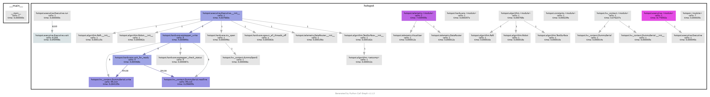

# How To

This doc contains instructions for various tasks related to setting up and running the `hotspot` mirror mapper.


# Setting Up the Environment

#### Is the environment set up?

First, check that the environment setup has not been done before. If 

```bash
conda activate hotspot
```
succeeds, skip these steps.

## Python Dependencies
### Anaconda

#### Is Anaconda set up?

If the Python environment/package manager [Anaconda](https://www.anaconda.com/) does not exist on the Raspberry Pi you're running this on, I recommend installing Miniconda like this:

```bash
curl "https://repo.anaconda.com/miniconda/Miniconda3-latest-Linux-armv7l.sh" -o "Miniconda.sh"
chmod +x Miniconda.sh
./Miniconda.sh
```

Once that is done, we are ready to set up the `hotspot` environment. `conda` environments keep a project's dependencies from polluting your computer's environment and make sure they all play nicely together. `conda` allows specifying the dependencies needed in a file with a `.yml` extension. This is done for you. Create the `hotspot` conda env with

```bash
conda env create -f hotspot.yml
```

It should install things like `numpy` and `matplotlib`, as well as libraries for the hardware, such as Adafruit's `adafruit-circuitpython-motorkit` library for driving the steppers, and the `labjack-ljm` library for controlling the Hawkeye IR sources via the LabJack. There are also packages for documentation.

#### Is the LabJack library installed?

> **NOTE:** Driving Hawkeye sources with LabJack Python modules requires both the system libraries and the Python interface to be installed.

[Download and install](https://labjack.com/support/software/installers/ljm) the LJM libraries from LabJack.

Once that is done, activate the env with 

```bash
conda activate hotspot
```

## Keeping things up to date

If you need to install something new later on, remember to update `hotspot.yml` by doing 

```bash
conda env export --from-history | tee hotspot.yml
```

If your `hotspot.yml` has been updated, and you need to update your env with the new `hotspot.yml`, do

```bash
conda env update --file hotspot.yml --prune
```

# Software Testing with `pytest`

In order to verify that basic low-level functionality is unbroken, run `pytest` from the toplevel directory of the repo.

# Setting Up the Hardware

## Enable Raspberry Pi Hardware

#### Can the Raspberry Pi talk to the motor drivers?

The Raspberry Pi should have at least two [motor driver hat boards](https://learn.adafruit.com/adafruit-dc-and-stepper-motor-hat-for-raspberry-pi). These are blue PCBs with onboard chips that talk to the Raspberry Pi on an I2C bus via the 2x20 header pins. They issue commands to the motor driver chips, which handle the delivery and timing of greater voltage and current than the Raspberry Pi is capable of on its own.

If you are using a factory fresh Raspberry Pi, follow the steps for [Enabling I2C communication](https://learn.adafruit.com/adafruit-dc-and-stepper-motor-hat-for-raspberry-pi/installing-software#enable-i2c-1106864-2) from Adafruit. 

> **NOTE:** A backup pdf of instructions for this is saved in the `pdf` dir.

## Power

#### Are the power supply settings correct?

To power both the motors and Hawkeyes simultaneously, use a **GW Instek GPS-4303** power supply or equivalent; channels must supply:

* 12V constant voltage, 4A peak instantaneous current
* 6.7V constant voltage, 2A peak instantaneous current
* 5V constant voltage, 1A peak instantaneous current (optional, for chopped signal to TIME MCE CLK card)

Set the GW Instek GPS-4303 CH1, CH2, and optionally CH3 supply as shown:


Ensure the current limit knobs for each channel are sufficient to keep the power supply in constant voltage mode, even when the motors and Hawkeyes are drawing current. The C.V. indicator light should stay green.

### Motors

#### Do the motor drivers have power?

The Raspberry Pi cannot provide the requisite voltage or current to the motors on its own, so external power must be supplied. 
The motor controllers on each hat are designed to run with 5-12V, with a maximum instantaneous current of ~1.2A per channel.

For stacking multiple hats, jumpers are attached to the screw terminals to route +/- voltage to the additional hats. 

A lab power supply with 12V output is attached to the +/- screw terminal block on the motor driver hat.


As you can see, it's easiest to use leads with grabber probes to grab onto the +/- jumpers. 

### LabJack

#### Do the Hawkeyes have power via the LabJack?

The LabJack T7 with PS12DC power switching board also needs its own power supply.

A tunable lab power supply is attached to one of the screw terminals labeled "VS#," for "voltage source #," where # is one of the channels, 1-6. 

The Hawkeye IR-50 source temperature depends on the voltage applied, and the current draw depends on the voltage (see datasheet in `pdf` dir). The design target temperature is 750 C, requiring a voltage of 6.7V and a current of ~134mA per source, for a total current draw of ~1.74A when all sources are turned on. In practice, Hawkeye sources have not drawn quite this much current.

Connect the power supply and Hawkeye source wires to the LabJack as shown:


##### Optional: MCE CLK Sync

It may be desirable to supply the same chopped signal the Hawkeyes see, but at 5V, to the MCE CLK card via a BNC cable. If this is desired, use the power supply CH3 set to 5V, and attach to +5V and GND to the terminal labeled S4.

## Communication

### Raspberry Pi

#### Can you talk to the Raspberry Pi?

You can log in to the Raspberry Pi via `ssh`. In order for your computer to "see" it, though, they must be on the same network. This can be accomplished a few ways (or order of ease of use):

1. By connecting both computers to a router or network switch that can assign each connected device an IP address automatically. Wired is easier than [wireless](https://www.raspberrypi.com/documentation/computers/configuration.html#setting-up-a-headless-raspberry-pi).
1. By connecting directly to the pi via an Ethernet patch cable and setting up a [link-local](https://en.wikipedia.org/wiki/Link-local_address) connection
1. By connecting directly to the pi via an Ethernet patch cable and assigning static IP addresses to each host.

The first option is the easiest, but depends on having access to an exisiting network, so limits your connectivity options. If you have access to a Linux machine, the second option is about as easy.

 The hostname and password are printed on the bottom of the white plastic case. Once you think the connection is sorted out, ping the pi to check:
 
```bash
 ping timepi.local
```
 
 The ssh command goes like this:

```bash
 ssh -X pi@timepi.local
```

 `-X` allows X-forwarding, in case a graphical application (like plotting) is invoked. You will be prompted for a password, which you can find printed on the bottom of the white plastic Raspberry Pi case.

### Motors

#### Can the motor drivers command the motors?

If they are not already connected, motors should be connected to the screw terminals of the pi's stepper hat like this:


Getting the order right ensures the stepper's coils are energized in the correct sequence to get it to rotate.

The stepper motors themselves have NEMA-17 spec hole patterns, which mate to the 3D printed motor mount brackets which we will attach to the beam mapper frame. Each stepper motor should be attached to its motor mount using M3 x 0.5 x 10 mm screws. Use lubricant, because metal on plastic will be squeaky.

At this point, it is important to consider the mapping of motor driver terminal -> stepper motor -> motor mount -> corner of beam mapper frame. The `Executive.__init__()` function specifies this mapping, so the motor installation location and stepper instance in `__init__()` should match, to ensure the correct motor commands are sent to the correct stepper. Steppers and wire harnesses are labeled to assist with this.

In general, the driver board closest to the Pi (0n bottom) will be `kit0` (although this can be double-checked by looking at the address - `0x60` is the default I2C address for the hat, which can be changed by bridging the HAT pads A0-A4, so the board addressed by `0x60` will have no pads bridged). The terminal blocks M1-M2 are used for `stepper1` on each HAT, and M3-M4 are used for `stepper2`.

It doesn't really matter which terminal maps to which corner, but it really does matter that the code and physical arrangement agree.

## Spools

#### Can the motors make the lines longer and shorter?

If they are not already attached, the spools should be fixed to the 5 mm stepper motor shaft via one M3 setscrew. 

The fishing line is affixed to the each spool by wrapping it around the setscrew and screwing it in to the threaded recess on the spool circumference. Do not overtighten, as the threads are plastic.


> **NOTE:** Positive motor rotation is defined by convention to spin the shaft clockwise when viewed from the rear of the motor. Cables should be oriented relative to the spool such that a positive motor rotation produces a positive cable length change (i.e., cable is played out from the spool), and a negative motor rotation winds cable onto the spool.

After attaching the cables to the spools, the other end should be threaded through the ~.9mm hole in the motor mount bracket.

> **NOTE:** All cables should be long enough to permit the raft to visit each corner of the frame, even when the frame is as far apart as it can be (~25.5").

Finally, excess cable should be wound onto the spool, under tension, to avoid trapping excess cable underneath as the cable is wound on. This process should be done by hand.

## Raft

#### Will moving the lines move the Hawkeyes?

The end effector of this robot is a rectangular raft carrying several Hawkeye Technologies [IR-50](http://www.hawkeyetechnologies.com/source-selection/pulsable/) emitters. The robot drives the centroid of the effector to a specified position, and the control algorithm performs a specific sequence of flashes using a number of the emitters to enhance the detectability of the signal in the TIME receiver output data.

If the raft is not already attached to the cables, the raft cap with the Hawkeye emitters must be removed to access the screws to fix the affix the lines.

Simply pass them through the raft's eyelets, wrapping the ends of the fishing line around the screws in each corner of the raft, and screwing them down. 

### Cable Maintenance

#### What if a cable breaks?

The lid of the raft is secured by clips and a dab of cyanoacrylate glue in each corner. If the cables need to be changed (e.g., they are worn), an exacto blade can be used to break the CA glue in the corners and remove the lid. The original cable is Spiderwire EZ Braid braided dyneema fishing line (50 lb pull strength), chosen for its stretch resistance. A replacement can be found at any tackle store or Wal-Mart, but a spool of extra cable should already be stored with the beam mapper.


## Frame

#### Is the frame fully assembled?

The 3D printed stepper motor mounts are attached to the beam mapper frame by 5/16-18 x 2" or 2.25" bolts with nyloc "jam" nuts.

Two aluminum registration tabs are screwed into the end of each frame piece opposite the black plastic end caps, using a 5/16-18 x 1/4" screw. They are long enough to reach an edge of the mirror regardless of if the mirror's corners have been machined off. 

> **NOTE:** These tabs register the frame to a third edge of the mirror, so **it is important that they not be bent**.

Long 5/16-18 steel threaded rods connect the two halves of the frame. On one end of the threaded rods, a nyloc "jam" nut on the outside of the perforated aluminum extrusion provides clamping force. On the other end of the threaded rod, a slide-adjust nut with a thumb button allows easily changing the distance between clamping surfaces, and applies clamping force to the outside of the opposite aluminum extrusion. 

# Input File Creation

## Coordinate System

 In order for the raft to be moved to a meaningful position in mirror-space, coordinates must be referenced to sensible locations where the mirror edges and robot frame register to one another.

 * **x-axis**: plane of contact between the "south" frame and an edge of the mirror
 * **y-axis**: plane of contact between the "west" side aluminum registration tab and a perpendicular mirror edge.
 
 The coordinate system of the robot therefore has its origin at the SW corner, where the aluminum alignment tab on the fixed frame meets the aluminum extrusion face.
 
## Input Files

There are two types of input files: `geometry` and `profile`
`.ipynb` files are provided in the input directories to assist with making these input files.

The Raspberry Pi does not have Jupyter installed, so you may want to run these notebooks on your own machine.

### Geometry
Geometry files are one-line .csv files in `hotspot/data/input/geometry`. 

`create_geometry.ipynb` is provided to script the creation of geometry files.

Each one defines the physical setup of the robot when it is in a certain configuration, for instance, when it is installed on a mirror of a certain dimension. Each column entry describes an aspect of the physical setup of the system. A simplistic example:

| sw_0  | sw_1  | nw_0  | nw_1  | se_0  | se_1  | ne_0  | ne_1  | w  | h |
|:--:|:--:|:--:|:--:|:--:|:--:|:--:|:--:|:--:|:--:|
| 0  | 0  | 0  | 1  | 1  | 0  | 1  | 1  | .1  | .1 |


Each corner point is the location of an eyelet through which the cable passes, expressed relative to the SW origin, described above. The width and height of the raft are defined by the separations between eyelets on the raft through which the cable passes.

> **NOTE:** Since the dimensions of the motor mounts have been measured relative to each edge, the positions of the corner eyelets can be calculated as a function of the separation between the aluminum extrusions that make up the support structure and clamping surfaces.

> The eyelets of the motor mounts measured 6.19 +/- 0.5 mm from the frame to the face of the motor mount bracket on the interior of the mapping region, and 7.96 +/- 0.02 mm from the face of the motor mount to the eyelet, for a total eyelet offset from the contact patch of 0.014 +/- 0.001 m. This value will be used to calculate eyelet y-positions as a function of frame separation.

> The eyelet positions should not change in the x-direction, unless the motor mounts are removed from the aluminum frames.

### Profile

Profile files are multi-line .csv files in `hotspot/data/input/profiles`. Each one defines a new position to which the robot should move, in the coordinate system defined above.

`geometry/create_profile.ipynb` is provided to script the creation of profiles.


Upon reaching each location in the profile, the robot is programmed to flash Hawkeye sources on and off (default: 10 "on" states, 50% duty cycle, 5 Hz). Which group of sources is enabled is configurable with the `flasher_cmds` column in the profile .csv. Each 0 or 1, space-separated, in the first column, corresponds to one of twelve addressable solid state switchable voltage sources on the LabJack PS12DC Power Switching Board. The index-to-address mapping is defined in the dictionary at the top of `hardware.py`. Since there are 3 groups of Hawkeye sources, there are more addressable relays than strictly necessary.

For example, to move to a single coordinate and flash all addresses:

| flasher_cmds            | pos_cmd_0s | pos_cmd_1s |
|:-----------------------:|:----------:|:----------:|
| 1 1 1 1 1 1 1 1 1 1 1 1 | .5         | .5         |

to move to a single coordinate and flash only the center Hawkeye:

| flasher_cmds  | pos_cmd_0s | pos_cmd_1s |
|:-------------:|:----------:|:----------:|
| 1 0 0 0 0 0 0 0 0 0 0 0 | .5         | .5         |

to move to a single coordinate and flash the center and inner ring Hawkeyes:

| flasher_cmds            | pos_cmd_0s | pos_cmd_1s |
|:-----------------------:|:----------:|:----------:|
| 1 1 0 0 0 0 0 0 0 0 0 0 | .5         | .5         |

to move to a single coordinate and flash all Hawkeyes (center, inner ring, outer ring):

| flasher_cmds            | pos_cmd_0s | pos_cmd_1s |
|:-----------------------:|:----------:|:----------:|
| 1 1 1 0 0 0 0 0 0 0 0 0 | .5         | .5         |

Building up a sequence of moves allows a shape to be scanned.

## Output Files

Output files store telemetry for each run in `data/output`. They are timestamped `.hdf5` files.

# Physical Installation and Operation

## Physical Installation

### General tips

* Having two people helps.

* _<span style="color:red">**BE VERY CAREFUL** about touching the buttons on the black slide-adjust nuts</span>_
    * If you are adjusting the mapper spacing and you let them off of the threaded rod, they will disassemble themselves rapidly. You don't want to lose any parts.
    * If you are loosening or tightening the mapper down to anything, when the mapper is under tension, touching the button could release tension rapidly, potentially causing a fall, which you do not want.

* Bring a power strip to make moving the PSU and Raspberry Pi to various mirrors easier. Bring a long ethernet cable to plug the Raspberry Pi into the rack's network switch.

* Don't bother trying to tape Eccosorb to anything. Just pinch it in between the mirror and threaded rod. This also helps keep the threaded rod from marring the mirror surface.

* Keep as much stuff as possible out of the path of the beam.

### K1

Underneath shutter, highest up. Put a step ladder inside the K-mirror frame to make the lift easier. Route Hawkeye cables around back of K1 and down.

`python main.py ./data/input/geometry/K1.csv ./data/input/profiles/K1_<profile>.csv`


### K2

Should be easy. Remove the anti-head-smasher foam first.

`python main.py ./data/input/geometry/K2.csv ./data/input/profiles/K2_<profile>.csv`


### K3

Pucker factor 11. Gravity is working against you, and you're right on top of F1, but snug things down good and tight when mounting the mapper and you will be fine. I used a crescent wrench on the black slide-adjust nuts for this one. Be careful not to release the slide-adjust nuts when using the wrench.

`python main.py ./data/input/geometry/K3.csv ./data/input/profiles/K3_<profile>.csv`


### F1

Another easy one.

`python main.py ./data/input/geometry/F1.csv ./data/input/profiles/F1_<profile>.csv`


### P2

Not currently reachable (clearance issues).

## Operation

When a surface geometry file has been created and the profile for the given shape to be mapped is generated, we are ready to run the program. There should already be geometry and profile files in the `data/input` directories.

### A Note on Homing

Homing a system with no stall sensing in the motor driver solution and no limit switches is possible, but crude. 

To get around the fact that there is no feedback, the current homing solution is to release all but one axis, then issue enough retracting steps to the remaining motor to ensure the raft has reached the limit of its travel toward that axis (NW at the time of writing). This axis is then held while the other steppers issue enough retracting steps to ensure all cables are taut. The raft is then in a known position and orientation relative to the frame, so the mapper is homed.

You will hear and see vibration while this happens.


It is a simple, hands-free homing solution, but there is plenty of room for improvement here. Sensors would not be hard to add, would speed up homing, and would reduce the wear on cables (and probably motors) due to the current solution.

## Pre-mapping checks

1. Make sure that 12V is being supplied to both motor driver boards in the stack, that the polarity is correct.
2. Make sure that 6.7V or less is being supplied to the LabJack switching board.
3. Make sure the power supply output is on.
4. Make sure that the cable is wound onto each spool and that no loops of excess cable are trapped underneath the cable wound onto the spools.
5. Check the excess cable played out in the raft's current position. Some excess is fine as long as it doesn't interfere with the raft's motion. If the cable is taut before homing, this is also fine, but the homing routine may need to be run a few times before the raft reaches the home position.
6. Ensure the Hawkeye source signal lines won't interfere with mapper operation.
7. Ensure the `hotspot` `conda` env is active: `conda activate hotspot`.

## Mapping

1. Start the program with `python main.py ./data/input/geometry/<geometry.csv> ./data/input/profiles/<profile.csv>`
2. Perform a homing calibration: `c`, `RETURN` key. 
3. The NW motor will drive the raft to the NW corner while the NE, SW, SE axes go slack, and NW should begin skipping steps after reaching the limit. This (and some noise) is normal. The other axes then tension automatically.
4. Verify that the raft reached its home against the NW corner, and that the other axes achieved tension. If not, GOTO 2.
5. Perform a mapping sequence: `s`, `RETURN` key. 
6. The raft will drive to each location and flash the Hawkeyes at each point in the sequence. Observe the mapper, ensuring the Hawkeye signal cable does not interfere with the mapper.
    1. You may request a mode change at any time. Mode changes are processed at the end of each move.
    2. You may abort the program with `Ctrl+C`.
7. Upon completing a sequence, it may be repeated by requesting the sequence mode again.

# Other Documentation

## Example Call Graph

Generated without motors or LabJack attached, so this does not include overhead of those libraries, but the control flow is the same.



## Module Flow Charts

### Executive


## Reference HTML
The html documentation of the source code and Markdown materials is generated by [portray](https://timothycrosley.github.io/portray/).

To regenerate the documentation, execute:

```bash
portray as_html -m hotspot -o docs/html/ --overwrite
```

## `pycallgraph`

To re-generate the call graph image, directory, run
```bash
pycallgraph -i "alg*" -i "const*" -i "exec*" -i "hardw*" -i "hot*" -i "hw*" -i "tele*" graphviz --output-file=../doc/img/pycallgraph.png -- main.py ../data/input/geometry/frame.csv ../data/input/profiles/box_frame.csv
```
You must have `graphviz` installed using your operating system's package manager. For most accurate graph and timing information, do this with all peripheral hardware attached, so the call graphs include interfacing with the motor drivers and LabJack.
