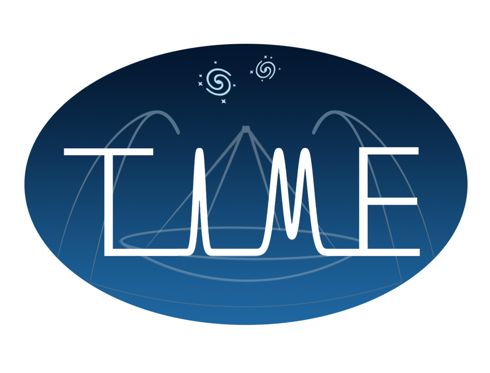

This repo contains code that is a part of the [TIME collaboration](https://ui.adsabs.harvard.edu/abs/2014SPIE.9153E..1WC/abstract).



Logo by Guochao (Jason) Sun.

# hotspot

Code for driving a cable-driven parallel robot for mapping beams on surfaces.

The robot moves and controls switchable thermal infrared sources to scan a 2D x-y plane, and is capable of absolute accuracy at the <3 mm level over a workspace ~0.40m x 0.40m.

## Running

Run `python main.py -h` for the docstring describing the command line interface.

### Example

```bash
python main.py ./data/input/geometry/frame.csv ./data/input/profiles/circle.csv
```

## Other Documentation

See the [HOWTO](HOWTO.md).

## Contributing

### Testing
Testing is accomplished with `pytest`. Passing tests are a prerequisite for committing code, and new code should come with new tests.

To run the test suite defined in the `tests` dir, change dir to the toplevel dir of the repo and execute 
```bash
pytest
```

### Pushing changes
If you need push permissions, message me. Otherwise, you may fork, create a new branch with your changes, and fill out a Pull Request to have the changes reviewed and merged in.

### How did you make your algorithm flowcharts?
[diagrams.net](https://diagrams.net)
