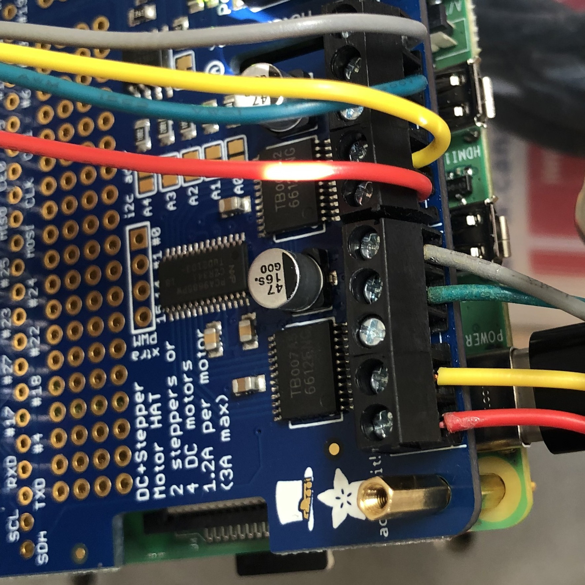
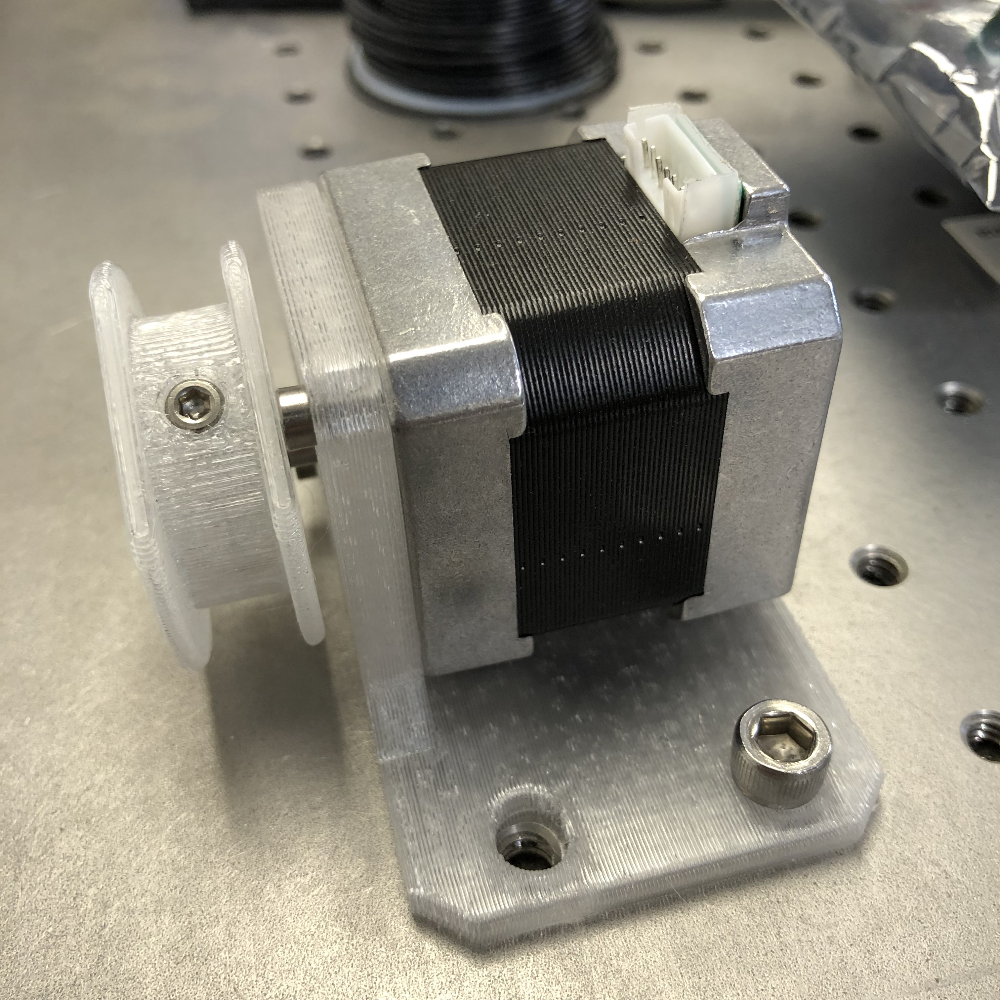
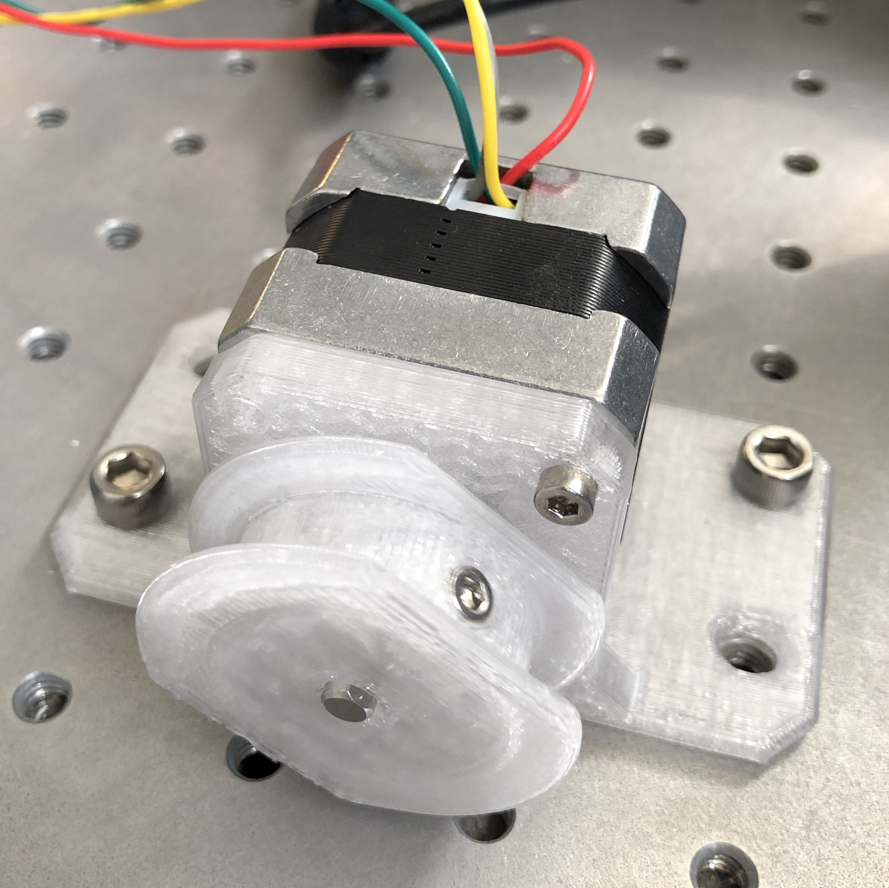

# How To

This doc contains instructions for various tasks related to setting up and running the beam mapper.

# Setting Up the Environment

First, check that the environment setup has not been done before. If 
```bash
conda activate hotspot
```
succeeds, skip these steps.

## Python Dependencies
### Anaconda
If the Python environment/package manager [Anaconda](https://www.anaconda.com/) does not exist on the Raspberry Pi you're running this on, I recommend installing Miniconda [from here](https://docs.conda.io/en/master/miniconda.html). Get the installer for ARM processors (it has `aarch64` in the name) and follow the online instructions.

Once that is done, we are ready to set up the `hotspot` environment. `conda` allows specifying the packages needed in a file with a `.yml` extension. This is done for you. Create the `hotspot` conda env with

```bash
conda env create -f hotspot.yml
```

It should install things like `numpy` and `matplotlib`, as well as drivers for the hardware, such as Adafruit's `adafruit-circuitpython-motorkit` library for driving the steppers, and the library for controlling the Hawkeye IR sources via the LabJack.

Once that is done, activate the env with 

```bash
conda activate hotspot
```

If you need to install something else, remember to update `hotspot.yml` by doing 

```bash
conda env export --from-history | tee hotspot.yml
```

If your `hotspot.yml` has been updated, and you need to update your env with the new `hotspot.yml`, do

```bash
conda env update --file hotspot.yml --prune
```

# Setting Up the Hardware

## Enable Raspberry Pi Hardware

The raspberry pi should have at least two [motor driver hat boards](https://learn.adafruit.com/adafruit-dc-and-stepper-motor-hat-for-raspberry-pi). These are PCBs with onboard chips that talk to the raspberry pi on an I2C bus via the 2x20 header pins. They issue commands to the motor driver chips, which handle the delivery and timing of greater voltage and current than the raspberry pi is capable of on its own.

Follow the steps for [Enabling I2C communication](https://learn.adafruit.com/adafruit-dc-and-stepper-motor-hat-for-raspberry-pi/installing-software#enable-i2c-1106864-2) from Adafruit. A backup pdf is saved in the `pdf` dir.

## Power

### Motors
The motor driver board must be powered via its own power supply, since the raspberry pi cannot provide the requisite voltage or current. A lab power supply with 12V output is attached to the +/- screw terminal block on the motor driver hat. For stacking multiple hats, jumpers are attached to the screw terminals to route +/- voltage to the additional hats. The motor controllers on each hat are designed to run with 5-12V, with a maximum instantaneous current of ~1.2A.

### LabJack
The LabJack board also needs its own power supply to drive the voltage/current that is switched via the breakout board. A tunable lab power supply is attached to one of the screw terminals labeled "VS#," for "voltage source #," where # is one of the channels, 1-6. The voltage of this power supply will depend on what is hooked up to the switchable terminals. In this case, we are using LEDs to stand in for Hawkeye IR sources, so 3.3V is fine.

## Communication

### Raspberry Pi
You can log in to the raspberry pi via `ssh`. In order for you computer to "see" the raspberry pi, though, they must be on the same network. This can be accomplished a few ways (or order of ease of use):
1. By connecting both computers to a router or network switch that can assigns each connected device an IP address automatically. Wired is easier than [wireless](https://www.raspberrypi.com/documentation/computers/configuration.html#setting-up-a-headless-raspberry-pi).
1. By connecting directly to the pi via an Ethernet patch cable and setting up a [link-local](https://en.wikipedia.org/wiki/Link-local_address) connection
1. By connecting directly to the pi via an Ethernet patch cable and assigning static IP addresses to each host.

The first option is the easiest, but depends on having access to an exisiting network, so limits your connectivity options. If you have access to a Linux machine, the second option is about as easy and more flexible, in my opinion.

 The hostname and password are printed on the bottom of the white plastic case. Once connection is sorted out, ping the pi to make sure:
 
 ```ping timepi.local```
 
 The ssh command goes like this:

 ```ssh -X pi@timepi.local```

 `-X` allows X-forwarding, in case a graphical application (like plotting) is invoked. You will be prompted for a password, which you can find printed on the bottom of the white plastic raspberry pi case.

### Motors

Motors should be connected to the screw terminals of the pi's stepper hat like this:



Getting the order right ensures the stepper's coils are energized in the correct sequence to get it to rotate.

The stepper motors have NEMA-17 spec hole patterns, which mate to the 3D printed CFRP motor mount brackets which we will attach to the beam mapper frame. Each stepper should be attached to its motor mount using M3 x 0.5 x 10mm screws. Use lubricant, because metal on CFRP will be squeaky.

At this point, it is important to consider mapping of motor HAT terminal -> stepper motor -> motor mount -> corner of beam mapper frame. The `Executive.__init__()` function specifies this mapping, so the motor installation location and stepper instance in `__init__()` should match, to ensure the correct motor commands are sent to the correct stepper.

In general, the HAT closest to the Pi will be `kit0` (although this can be double-checked by looking at the address - `0x60` is the default I2C address for the hat, which can be changed by bridging the HAT pads A0-A4, so the board addressed by `0x60` will have no pads bridged). The terminal blocks M1-M2 are used for `stepper1` on each HAT, and M3-M4 are used for `stepper2`.

It doesn't matter which terminal maps to which corner, only that the code and physical arrangement agree.

## Spools

The spools are each attached to the 5mm stepper motor shaft via one M3 setscrew. The fishing line is affixed to the each spool by wrapping it around the setscrew and screwing it in to the threaded recess on the spool circumference. 

	

Positive motor rotation is defined by convention to spin the shaft clockwise when viewed from the rear of the motor. Motors should be oriented relative to the cable such that a positive motor rotation produces a positive cable length change (i.e., cable is played out from the spool), and a negative motor rotation winds cable onto the spool.

After attaching the cables to the spools, the other end should be routed through the ~.9mm hole in the motor mount bracket.

## Effector

The end effector of this robot is a rectangular raft carrying several Hawkeye Technologies [IR-50](http://www.hawkeyetechnologies.com/source-selection/pulsable/) emitters. The robot drives the centroid of the effector to a specified position, and the control algorithm performs a specific sequence of flashes using a number of the emitters to enhance the detectability of the signal in the TIME receiver output data.

The effector is attached to the cables by simply wrapping ends of the fishing line around the screws in each corner of the raft and screwing them down.

## Frame

The 3D printed CFRP stepper motor mounts are attached to the beam mapper frame by 5/16-18 x 2" or 2.25" bolts with nyloc "jam" nuts.

A 3D printed CFRP "homing bar" with a corner reference feature sticks out into the mapping region to provide a repeatable location for placing the corner of the effector raft. This part is attached to the beam mapper frame with one 5/16-18 x 2" or 2.25" bolt with nyloc "jam" nut. Ensure the arm is pressed flat against the inside of the frame, no matter where it is attached.

Four 3D printed CFRP 3" x 2.5" registration tabs are provided to enhance the clamping surface the frame can use along the perimeter of a given mirror. They should be installed with 5/16-18 x 2" or 2.25" bolts with nyloc "jam" nuts, two apiece, installed on the interior of the frame, and oriented such that they extend "down" from the frame, opposite the motor mount brackets. They can be installed in any location along the frame, provided they avoid contact with the mirror's laser tracker nest tabs when the frame is mounted to the mirror.

Two aluminum registration tabs are screwed into the end of each frame piece opposite the black plastic end caps, using a 5/16-18 x 1/4" screw. They are long enough to reach an edge of the mirror regardless of if the mirror's corners have been machined off. These tabs register the frame to a third edge of the mirror, so **it is important that they not be bent**.

When all of these pieces are attached to the frame, it is ready to install onto a mirror for mapping.

# Test Fixture Setup

For testing the software and hardware together, we set up the raspberry pi and the steppers on an optics bench in Steward Observatory Lab 168. This allows us to affix the steppers to something a roughly known distance apart.

## Stepper Fixture

Steppers are attached to the optics bench for testing via 3D-printed brackets. 1/4-20 socket head cap screws affix the bracket to the bench, and M3 screws affix the steppers to the brackets.
 

## Fishing line routing

On the optics bench, the fishing line was routed from the motor spools to the raft via 3D printed posts, forming 4 corners of a rectangle to emulate the operational configuration. These posts were 3D printed 1/4-20 screws in PETG plastic, with ~.9mm (as designed, not as printed) holes in the top to allow routing the fishing line through.

## Test raft

For testing purposes, the raft was another 3D printed part, a rectangular plastic coupon with four holes to accept M3 screws for tying down the ends of the fishing line a known distance apart. This was done in lieu of having a raft of Hawkeye sources ready.
