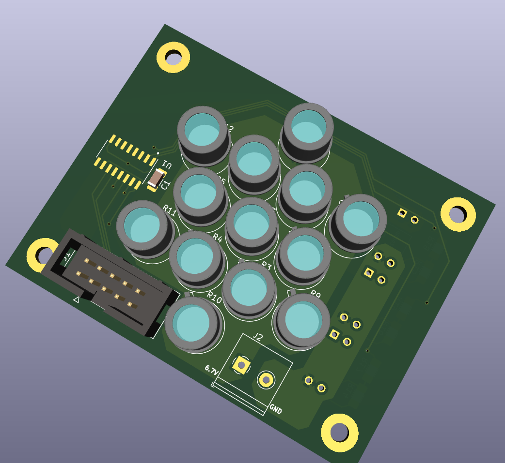
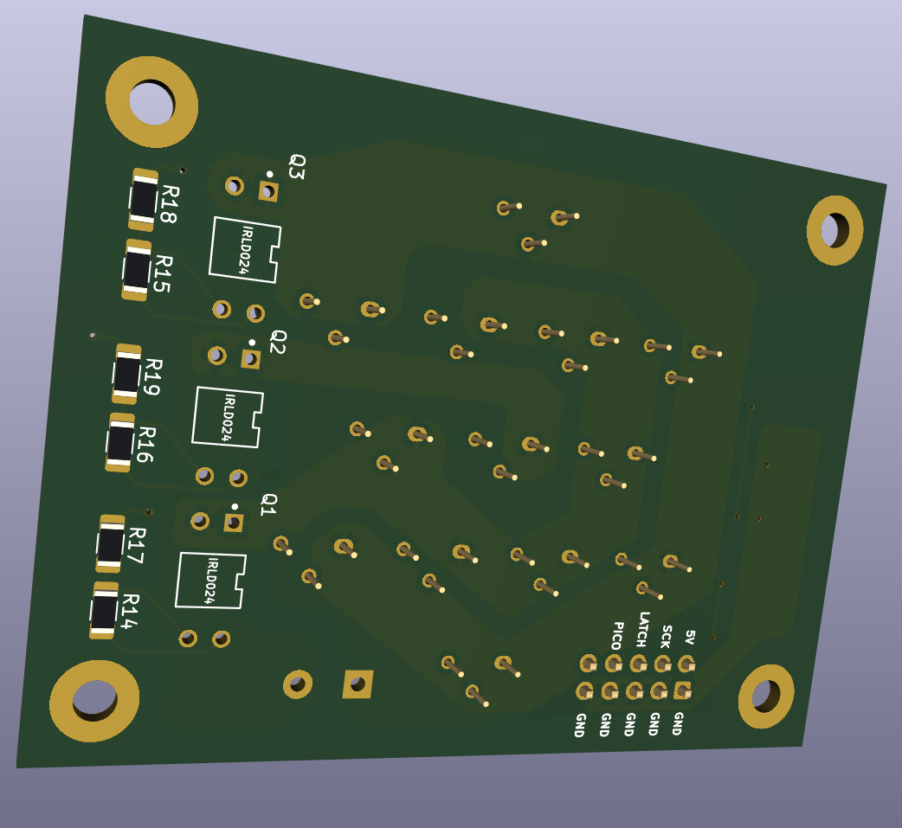
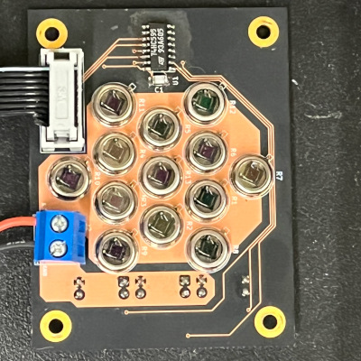

# Bill of Materials

2024-01-11 Evan C. Mayer

## Components

Originally developed to be driven by a microcontroller, with each ring selectable via a shift register circuit. If you send a logic-level square wave to MOSFETs some other way, you may omit the items necessary for the shift register driver circuit, marked with an asterisk.

| Part Name | Vendor | Part No. | Link | Qty. | Approx. Cost (USD ea.) | Rationale |
| -- | -- | -- | -- | -- | -- | -- |
Modulated Infrared Source | Hawkeye Technologies | IR-50 | [Link](http://www.hawkeyetechnologies.com/source-selection/pulsable/#ir5x/) | 13 | 70.00 | Infrared Emitter |
| Carrier Board | Oshpark | - | [Link](https://oshpark.com/shared_projects/rne2hvI5) | 3 | 10.03 | Assembly/Signal/Power delivery |
| Power MOSFET | Digikey | IRLD024 (sub. IRLD024PBF) | [Original](https://www.digikey.com/en/products/detail/vishay-siliconix/IRLD024/51139) [Sub.](https://www.digikey.com/en/products/detail/vishay-siliconix/IRLD024PBF/812492) | 3 | 1.88 | Power switching via logic-level inputs |
| Resistor 1 | Digikey | RMCF1206JT100R | [Link](https://www.digikey.com/en/products/detail/stackpole-electronics-inc/RMCF1206JT100R/1757426) | 3 | 0.10 | Voltage divider upper. Any 100 Ohm 1/4 W SMD 1206 package. |
| Resistor 2 | Digikey | RMCF1206FT10K0CT-ND | [Link](https://www.digikey.com/en/products/detail/stackpole-electronics-inc/RMCF1206FT10K0/1759669) | 3 | 0.10 | Voltage divider lower. Any 10 kOhm 1/4 W SMD 1206 package. |
| Terminal block | Tri-tek | PHITB132 (sub. TO0201520000G-ND) | [Original](https://www.tritekelectronics.com/wire-termination/terminal-blocks-and-barrier-strips/philmore-tb132) [Sub.](https://www.digikey.com/en/products/detail/amphenol-anytek/TO0201520000G/4953320) | 1 | 0.50 | Power wire connection |
| Shift Register* | Digikey | NTE74HC595T | [Link](https://www.digikey.com/en/products/detail/nte-electronics-inc/NTE74HC595T/11650421?s=N4IgTCBcDaIHYBcCmB2ALACQMIFYCcOIAugL5A) | 1 | 0.55 | Addressable outputs for power switching |
| I2C capacitor* | Digikey | 2368-SMC1206Z104-ND | [Link](https://www.digikey.com/en/products/detail/nte-electronics-inc/SMC1206Z104/11644126) | 1 | 0.05 | I2C noise decoupling capacitor |
| Ribbon cable termination* | Digikey | MSC10A-ND | [Link](https://www.digikey.com/en/products/detail/3m/89110-0001/229679) | 1 | 1.45 | Mates to pins on board header |
| I2C header* | Digikey | 30310-6002HB-ND | [Link](https://www.digikey.com/en/products/detail/3m/30310-6002HB/1237393) | 1 | 0.75 | Provides pwr, I2C header to shift register on board |
| I2C cable* | Adafruit | 3890 | [Link](https://www.adafruit.com/product/3890) | 1 | 3.95 | Sub. any 5-10 conductor 28 AWG ribbon cable if flexible silicone insulation not needed.
| Adafruit Trinket M0 Microcontroller* | Adafruit | 3500 | [Link](https://www.adafruit.com/product/3500) | 1 | 8.95 | Sends bytes to shift register over I2C to chop IR source banks on/off. Sub. any Arduino-compatible microcontroller, with slight code changes.